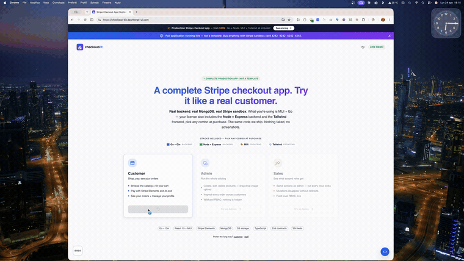

# Checkout Kit — Demo · React + Stripe checkout starter (MUI)

[](https://github.com/kensaadi/checkout-kit-demo/actions/workflows/ci.yml)
[](https://checkout-kit.dashforge-ui.com)
[](https://dashforge-ui.com/starter-kits)




A free, **runnable** demo of a production-style **Stripe checkout app** built with
**React 19 + TypeScript + MUI** — storefront, server-side-style cart, and a
three-step checkout wizard. It runs **fully in mock mode** (in-memory data, no
backend, no real payments), so you can `clone → install → run` and explore the
whole flow in under a minute.

> **This is the front-end only, in mock mode.** The production application —
> Node/Go backend, signed & idempotent **Stripe webhooks**, an order state
> machine, field-level **RBAC** and an **admin dashboard** — is the paid
> **Checkout Kit** → **[dashforge-ui.com/starter-kits](https://dashforge-ui.com/starter-kits)**.

**Live demo (with the real backend):** https://checkout-kit.dashforge-ui.com

**▶ Watch the 90-second demo:**

[](https://youtu.be/tc1TY4ca06I)

## Quick start

```bash
git clone https://github.com/kensaadi/checkout-kit-demo.git
cd checkout-kit-demo
pnpm install
pnpm dev
```

Open the printed URL. On the splash screen click **Open demo splash** to sign in
as customer / admin / sales in one click (mock auth — no real credentials). Drop
a product in the cart and walk the checkout. Everything is in-memory; nothing is
charged.

> Runs in mock mode out of the box (`mui/.env` ships `VITE_PROVIDER=mock`).

## What's in the demo (the UI)

- **Storefront** — product grid & compact table views, product detail with gallery
- **Cart** — quantity steppers, totals, empty state
- **Checkout** — a three-step wizard (resume → payment → complete) with Stripe
  Elements UI (mocked)
- **Orders & profile** — order history, order detail, profile with field-level
  RBAC hints
- **Admin view** — catalog, orders and a dashboard (read-only over mock data)
- **Two view modes, i18n-ready labels, light/dark theme**

All of it on **React 19 + TypeScript + MUI**, driven by a typed API client whose
providers are swapped between `live` and `mock` per domain.

## What's **not** here — that's the kit

An AI (or an afternoon) gives you a checkout *demo*. The parts that take weeks and
are dangerous to get subtly wrong are **not** in this repo — they're the
production **[Checkout Kit](https://dashforge-ui.com/starter-kits)**:

| In this demo | In the Checkout Kit |
|---|---|
| Mock data, in-memory | Real **Node/Express** _and_ **Go** backend, MongoDB |
| Stripe Elements UI (mocked) | Real **Stripe** flow — signed, **idempotent webhooks** (a retry never double-charges or double-ships) |
| — | **Order state machine** + refunds flow |
| Client-side cart | **Server-side cart** with stock checks (never client-trusted) |
| RBAC hints in the UI | **Field-level RBAC enforced on the backend** |
| Admin over mock data | Full **admin dashboard** — catalog, orders, revenue |
| MUI only | **MUI _and_ Tailwind** frontends — same app, your choice |
| — | Seed data, deploy configs, full documentation, support |

👉 **Get the production kit:** https://dashforge-ui.com/starter-kits

## Tech stack

React 19 · TypeScript · MUI · React Router · React Hook Form · Valtio · Vite ·
Stripe Elements · axios (+ mock adapter)

## About

Built by [Dashforge-UI](https://dashforge-ui.com) — finished, production-grade
React + Node/Go starter kits you own: authentication, Stripe checkout, and
booking. This demo is the free front-end slice of the Checkout Kit.

## License

This demo is provided for evaluation. See the production
[Checkout Kit](https://dashforge-ui.com/starter-kits) for the licensed,
full-source product and its terms.
